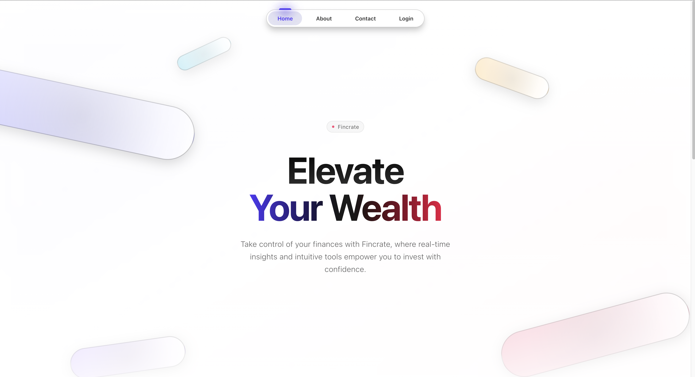
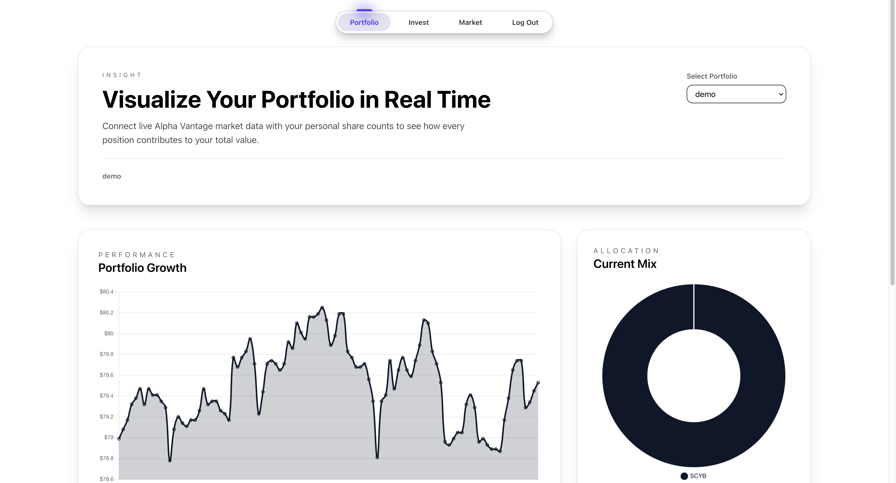
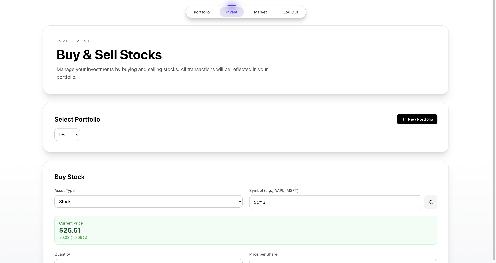
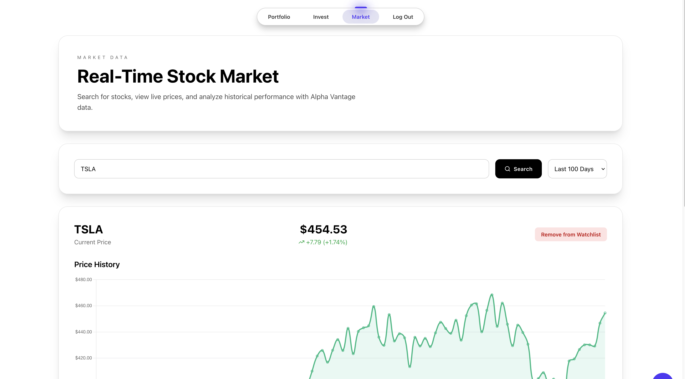

<h1>Fincrate</h1>

<h3>Overview</h3>
Fincrate is a full-stack web application that enables users to track, analyze, and optimize their investment portfolios.
It supports stocks, ETFs, and cryptocurrencies, delivering real-time analytics, secure account management, and AI-powered investment recommendations, all within a clean, professional interface inspired by modern fintech platforms.

<h3>Screenshots</h3>

**Landing Page**



**Portfolio Dashboard**



**Investment Management**



**Market Data**



<h3>Tech Stack</h3>

**Frontend**
- Next.js 16 (React 19)
- Tailwind CSS
- Framer Motion (animations)
- Chart.js (data visualization)
- Lucide React (icons)

**Backend**
- Node.js with Express
- PostgreSQL (Supabase)
- JWT authentication
- Google Gemini AI (chatbot)

**APIs**
- Alpha Vantage (market data)
- Finnhub (alternative market data)
- Google Generative AI (financial advisor)

<h3>Installation & Setup</h3>

**Prerequisites**
- Node.js (v18 or higher)
- PostgreSQL database (Supabase recommended)
- API keys: Alpha Vantage, Gemini API

**Backend Setup**

1. Navigate to backend directory:
```bash
cd backend
npm install
```

2. Create `.env` file:
```env
DATABASE_URL=your_postgresql_connection_string
JWT_SECRET=your_jwt_secret_here
ALPHA_VANTAGE_API=your_alpha_vantage_key
FINNHUB_API=your_finnhub_key
GEMINI_API=your_gemini_api_key
```

3. Start backend server:
```bash
npm run dev
```

**Frontend Setup**

1. Navigate to frontend directory:
```bash
cd frontend
npm install
```

2. Start frontend:
```bash
npm run dev
```

3. Open browser to `http://localhost:3000`

<h3>Features</h3>

**Core Features**
- Portfolio tracking with real-time market data
- Buy/sell transaction management
- Interactive charts and analytics
- Asset search and price lookup
- Multi-portfolio support

**User Management**
- Secure authentication with JWT
- Role-based access (free/paid users)
- Cookie-based session management

**AI Financial Advisor (Paid Users)**
- Portfolio-aware chatbot powered by Gemini AI
- Personalized investment recommendations
- Real-time chat interface

<h3>API Endpoints</h3>

**Authentication**
```
POST /api/auth/register    - Create new account
POST /api/auth/login       - Login user
GET  /api/auth/me          - Get current user profile
```

**Portfolios**
```
GET  /api/portfolios           - Get all user portfolios
POST /api/portfolios           - Create new portfolio
GET  /api/portfolios/:id       - Get portfolio details with holdings
```

**Investments**
```
POST   /api/investments        - Add investment (buy)
DELETE /api/investments/:id    - Sell investment
```

**Market Data**
```
GET /api/market/search/:symbol     - Search for asset
GET /api/market/price/:symbol      - Get current price
GET /api/market/history/:symbol    - Get price history
```

**AI Chatbot (Paid Users Only)**
```
POST /api/chatbot    - Send message to AI financial advisor
```

<h3>User Roles</h3>

**Free Users**
- Full access to portfolio management
- Real-time market data
- Transaction tracking
- Analytics and charts

**Paid Users**
- All free features
- AI financial advisor chatbot
- Portfolio-aware investment recommendations

**Upgrade User to Paid**
```bash
cd backend
node scripts/upgrade-user-to-paid.js user@example.com
```

<h3>Database Schema</h3>

**Core Tables**
- `users` - User accounts with role (free/paid)
- `portfolios` - User portfolios
- `portfolio_holdings` - Current holdings per portfolio
- `assets` - Asset information (stocks, crypto, etc.)
- `transactions` - Buy/sell transaction history

<h3>Development</h3>

**Backend**
```bash
cd backend
npm run dev    # Runs with --watch flag for auto-reload
```

**Frontend**
```bash
cd frontend
npm run dev    # Next.js development server
```

**Helper Scripts**
```bash
# List all users and their roles
node scripts/list-users.js

# Upgrade user to paid
node scripts/upgrade-user-to-paid.js email@example.com

# Downgrade user to free
node scripts/downgrade-user-to-free.js email@example.com
```

<h3>Environment Variables</h3>

**Backend (.env)**
- `DATABASE_URL` - PostgreSQL connection string
- `JWT_SECRET` - Secret for JWT token signing
- `ALPHA_VANTAGE_API` - Alpha Vantage API key
- `FINNHUB_API` - Optional Finnhub API key
- `GEMINI_API` - Google Gemini API key for chatbot


<h3>Security</h3>

- JWT-based authentication with httpOnly cookies
- Password hashing with bcrypt
- Role-based access control
- CORS configuration for cross-origin requests
- Environment variable protection
